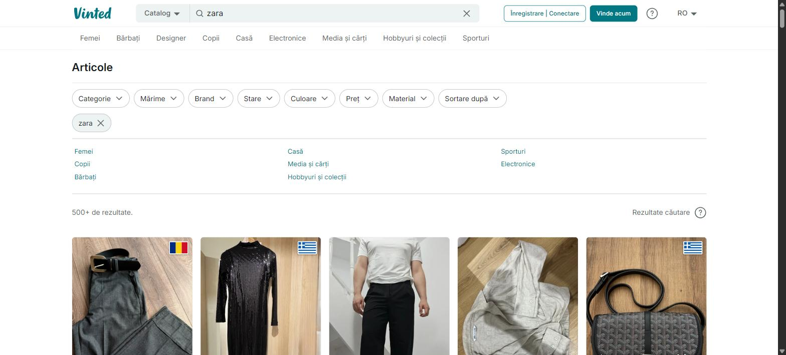

# Vinted Country Flags

Chrome extension that puts the seller's country flag in the corner of every item
on Vinted: the homepage, the search grid and the listing page. All 27 markets.



Vinted shows you items from sellers all over Europe and never says where they
are. Not on the card, not on the listing page, not in the HTML behind either.
The only way to find out is opening the seller's profile, which kills browsing.
This puts the answer on the picture.

## How it knows

Almost all of it comes free, from data Vinted already sends.

The catalog API returns a `conversion` object on any item whose seller prices in
a different currency than you see:

```json
"conversion": { "seller_price": "10000.0", "seller_currency": "HUF",
                "buyer_currency": "RON", "fx_rounded_rate": "0.01" }
```

No `conversion` at all means the seller prices in your currency. So the rule is
one line: take `seller_currency` when it is there and the buyer currency when it
is not, and if exactly one Vinted market uses that currency, that is the country.

Which currency belongs to which market is not hardcoded. `GET /api/v2/countries`
answers on every domain, needs no session, and returns the id, ISO code,
currency and localised name of all 27. The extension builds its table from that
and caches it for a week, so a new market appears on its own.

Inverting the live table gives nine currencies that pin a country outright: AUD,
CZK, DKK, GBP, HUF, PLN, RON, SEK, USD. Everything else is EUR, which eighteen
markets share, so those sellers get one `/api/v2/users/{id}` lookup each and are
then cached.

### Euro domains are the hard case, and there is no way around it

On vinted.ro one catalog call resolved 93 of 94 items for free. On vinted.fr it
resolved none of 95, and 0 of 259 items across three queries carried a
`conversion` at all. Every seller there prices in euro, so the currency only ever
says "somewhere in the eurozone" and every card costs a lookup.

| Domain | Items | Resolved free | Needs a lookup |
|---|---|---|---|
| vinted.ro | 94 | 93 (61 RON, 24 PLN, 8 HUF) | 1 |
| vinted.pl | 96 | 83 (76 PLN, 4 HUF, 2 SEK, 1 CZK) | 13 |
| vinted.co.uk | 94 | 94 (all GBP) | 0 |
| vinted.fr | 95 | 0 | 95 |
| vinted.de | 94 | 0 | 94 |

The flag is worth most exactly where it costs most: about a fifth of sellers on
those pages are foreign. On a French coffee category, 8 of 36 sampled sellers
were in Italy, the Netherlands or Spain.

So on a euro domain the grid fills in rather than appearing. Cards near the
viewport are resolved first, roughly twenty of them in the first twenty seconds,
and scrolling pays for the rest at about one a second. The popup says so in
words and shows how many are left, because a flag that is coming is otherwise
indistinguishable from a flag that is broken.

The cache is what makes this bearable over more than one page. It lives in the
service worker, not the tab, so a seller resolved on vinted.fr is already known
on vinted.de. Seller ids and item ids are global across markets.

### Lining the response up with the grid

Vinted's own URLs and its API disagree: `/catalog/13-jumpers-and-sweaters` keeps
the category in the path, the API only reads `catalog_ids`, and the filters the
page writes as `brand_ids[]=53` have to go out as `brand_ids=53`.
`src/catalog-query.js` translates one into the other. Skipping that step asks for
the generic front page feed, which on a fresh category page shared 4 of the 96
items on screen.

None of it is per-domain. Vinted translates the catalog slug and leaves the
numeric prefix alone, `/items/` and `/member/` are not localised at all, and the
card selector found 96 cards on vinted.pl, 93 on vinted.de, 94 on vinted.co.uk
and 94 on vinted.ro without a change.

Cards in a "more from this seller" row are not in the catalog response, but the
row header links to the seller, so the whole row costs one lookup no matter how
many items it holds. Grid cards name nobody, so they never use that path.

### The shuffle, and why the same query goes out four times

`order=relevance` does not return a fixed page. It draws 96 items out of a pool
half again as large and shuffles them, so two identical calls a second apart
share only about three quarters of their items. The grid Vinted server-rendered
is one such draw and ours is another, which left a quarter of the cards on
screen with no flag and no way to get one.

The fix is to ask again with the same query. Each repeat is a fresh draw from
the same pool, so the misses fill in. On
`/catalog/3480-coffee-tea-and-espresso-making`, cumulative grid coverage per
round ran 68, 74, 90, 93 out of 96 and then stopped improving, so the extension
stops at four rounds. Paginating instead does not work: page 2 comes out of the
same pool and added five matches for a whole extra request.

Every response also names 96 sellers, and currency pins most of them, so those
go into the cache too. A closet row by a seller who also has a grid item then
costs nothing, on that page or any later one, on any Vinted domain.

### The price itself gives the currency away

For whatever the draws still miss, the price on the card answers with no request
at all. Vinted prints every price in the buyer's currency, but a foreign
seller's price is their own number run through one exchange rate and rounded to
the cent, and that rounding is a fingerprint. On vinted.ro, 100 PLN comes out as
122,42 RON, and no whole number of lei and no whole number of forints lands on
122,42.

So divide the shown price by each rate and ask how round the answer is:

```
122.42 / 1.2242    = 100        exact, on a grid one zloty wide  -> 1.22 RON per step
122.42 / 0.0145666 = 8404.24    only exact to the hundredth of a forint -> 0.0001 RON
122.42 / 1         = 122.42     lei, but only to the cent        -> 0.01 RON
```

The coarser the grid a currency explains the price on, the fewer prices sit on
that grid, so the less likely the fit is a coincidence. The coarsest wins if it
wins by a factor of two, and otherwise the price is genuinely ambiguous and
`src/price-currency.js` answers nothing rather than guess.

A fit has to be coarser than about 0.20 EUR to count, expressed in whatever the
buyer sees. That number used to be one unit of buyer currency, which is a fine
guard in lei and no guard at all in forints, where every price on the page
clears a one-forint grid. The module refuses to answer until it has learned the
euro rate that converts the threshold.

No rate is hardcoded. They come out of the catalog responses the extension
already fetches, where every converted item carries the seller's price next to
ours, summed rather than averaged so the per-item cent rounding cancels. It
follows the daily fix by itself and picks up a new currency the day a market
starts showing one.

Held out against 936 items in five categories on vinted.ro, with rates learned
from a different 878: it answers for 95% of them and gets 99.7% of those right.
All three misses named EUR, which resolves to no flag, so none of them put a
wrong country on a card. On the coffee page it answered 92 of 95 and agreed with
the catalog on all 92.

On a euro domain the module turns itself off, correctly: it needs two currencies
before it will answer, and on vinted.fr it only ever sees one.

### The homepage is a different site

Everything above is about a catalog page. The homepage answers to none of it.
`/api/v2/catalog/items` does not return its feed at all: 0 of the 20 cards on
the vinted.ro homepage came back in a catalog draw. The endpoint that does serve
it, `api.vinted.<tld>/homepage/homepage`, answers 400 to the same query replayed
by anyone but Vinted's own front end. And its cards are numbered differently, so
even the selector missed them: every homepage card carries the same
`data-testid="feed-item--image"`, with the item id only in the link over the
photo.

None of that matters, because the homepage already tells you the seller. It just
does it twice, in two shapes:

- The first screenful is server rendered, and the React payload the page
  hydrates from is still sitting in the document with `"user":{"id":...}` on
  every item. Reading it is a string scan.
- Everything after it arrives on the XHR the page fires when the feed
  paginates, where the same fact is spelled `user_id`. `src/page-fetch.js`
  wraps `XMLHttpRequest.open` and reads that response as it goes past.

Both routes together named the seller of 70 of 70 cards on vinted.ro, 20 from
the document and 50 from one pagination response, for no request at all.

Knowing the seller is not the same as knowing the country, though, and 70 known
sellers is 70 lookups at one a second. So the homepage spends two catalog
requests it will never match a card with, purely to learn exchange rates, and
then reads the country off the price like any other card. Two draws rather than
one because the fingerprint refuses to answer until it knows the euro rate, and
a single draw on vinted.ro carried two euro sellers, one short of the three it
takes to trust a rate. With both in hand it answered 66 of the 70 cards, and a
spot check of 13 against the sellers' actual profiles agreed on all 13. Five
cards cost a lookup instead of seventy.

A euro domain skips those two requests. The fingerprint can never work there and
every seller in the response comes back as an unresolved eurozone marker, so the
homepage falls back to a lookup per card, same as its catalog pages.

A card the price refuses, and nothing else reached, gets the last resort: fetch
the item page, which links to exactly one member. That regex runs in the page
context so the two megabytes never cross into the extension, and only the seller
id comes back, followed by the usual profile lookup. Capped at six per page view
because it is an expensive way to learn one number.

## Being a good guest

The rate limit is measured, not guessed. From a cold bucket, exactly 30 requests
to `/api/v2/users` succeed and the 31st returns 429 with `Retry-After: 60`.
Paced at one per second, 45 in a row draw nothing. So it is a token bucket of
about 30 refilling at roughly 1 per second, and it is shared per IP: draining it
on vinted.fr leaves vinted.co.uk with 20 instead of 30.

- That bucket lives in the service worker, so every tab and every Vinted domain
  spends one budget. Per-tab throttling would have spent it once per tab.
- A card scrolled out of the viewport hands its token back rather than burning
  it, and work queued for it is dropped before it costs anything.
- 429, 403 or 503 stops all lookups and honours the `Retry-After` the response
  carries. The free currency flags keep working while it waits.
- `/api/v2/catalog/items` is not in the same bucket, or is far more generous:
  six rapid catalog calls answered 200 while `/users/` was still 429ing. Catalog
  rounds pace themselves a second apart instead of spending seller tokens.
- Sellers are cached for 30 days, items too, shared across every domain, so
  browsing the same searches costs nothing after the first visit.
- Requests go out from the page's own JavaScript context, so they are ordinary
  same-origin calls carrying the session you already have. Nothing is proxied,
  nothing leaves your browser.

## What it will not do

A price the fingerprint refuses is left to the item-page probe, and that probe
stops at six per page view, so a pathological page can still end with a few
blanks rather than ninety heavy fetches.

The fingerprint will not tell a Czech seller from a Romanian one until it has
seen a CZK item in a catalog response and learned the rate. Until then a
500 CZK item priced at 108,00 RON reads as a round number of lei and gets a
Romanian flag. That window is self-limiting: four draws of 96 items per page
view means a currency at even 1% of the market shows up and gets a rate.

An expensive foreign item stays unresolved for longer than a cheap one. The
tolerance is half a cent flat and the error in a learned rate is multiplied by
the seller's price, so a 500000 HUF listing needs a rate nailed down by hundreds
of samples. Widening the tolerance to compensate was worse: on simulated grids
it changed nothing once a few hundred rates were in, and with a handful it took
accuracy from 98% to 91%.

Guessing the seller from the DOM is still not an option for a grid card. An
earlier version walked up from the card and took the first `/member/` link it
found, which on a catalog page meant grabbing whichever closet row happened to
come first in the document and labelling unrelated items with its country. A
wrong flag is worse than no flag, so grid cards do not climb at all.

## Install

It is not on the Chrome Web Store, so it installs as an unpacked extension.

1. Download the zip from the
   [latest release](https://github.com/MolnarMario/vinted-country-flags/releases/latest).
2. Unpack it somewhere you will keep it. Chrome reloads the extension from that
   folder on every start, so do not delete it afterwards.
3. Go to `chrome://extensions` and turn on Developer mode, top right.
4. Click "Load unpacked" and pick the unpacked folder, the one holding
   `manifest.json`.
5. Open any Vinted market, for example https://www.vinted.fr/catalog?search_text=nike

Chrome will keep showing a "Disable developer mode extensions" warning on
startup. That is Chrome's standard nag for anything not installed from the
Store, not a problem with the extension.

Chrome will list 28 sites in the permission prompt. Match patterns cannot
wildcard a TLD, so every market has to be named.

The toolbar popup has an on/off switch, the coverage on the current page, how
much request budget is left, the cache counts, and a "clear cache" button. On a
euro domain it also shows how many cards are still filling in.

## Layout

```
manifest.json
src/worker.js       service worker: the shared token bucket and the cache
src/page-fetch.js   MAIN world: performs the fetches, nothing else
src/countries.js    the market table from /api/v2/countries, currency rule, names
src/price-currency.js  learns exchange rates, reads the currency off a price
src/throttle.js     the tab's queue in front of the worker's bucket
src/store.js        cache client, one message per lookup
src/feed-map.js     reads the homepage's own data for item id to seller id
src/content.js      DOM scanning, the resolution ladder, badge injection
src/badge.css
flags/*.svg         252 files: every ISO country, 76 drawn, the rest letter tiles
popup/
tools/              flag, icon and manifest generators, zip packager, test harness
test/
```

A seller can live in a country Vinted does not operate in, so any ISO code can
come back from a profile. Every one has a file; the 76 with a real drawing cover
the markets and their neighbours, and the rest get a legible two-letter tile. A
missing file still degrades to the neutral marker rather than a broken image.

Flags are bundled SVGs rather than emoji because Windows has no colour flag
emoji: `🇷🇴` renders as the letters "RO" in Chrome on Windows.

Regenerate the flags with `node tools/make-flags.mjs`. Domains live in
`tools/domains.mjs`; `node tools/make-manifest.mjs` writes them into the three
places `manifest.json` needs them. The toolbar icons are cut from
`icons/icon-source.png` by `powershell -File tools/make-icons.ps1`.

Build the shareable zip with `powershell -File tools/make-zip.ps1`. It picks up
the version from the manifest and leaves out `tools/`, `test/` and the full size
source art.

## Tests

```
node --test test/logic.test.mjs
```

49 tests over the currency rule against the real 27-market table, the country-id
join, the flag files, price parsing in every market's number format, the token
bucket's arithmetic and its handling of `Retry-After`, the catalog query
translation, the two homepage feed parsers, and the price fingerprint including
the cases that used to answer wrongly on a forint domain.

The DOM-dependent parts were verified against live pages: 12 of 12 flags matched
the seller's actual country on vinted.ro, and the card selector, the catalog
slug and the `/items/` and `/member/` paths were confirmed unchanged on
vinted.fr, vinted.de, vinted.pl, vinted.co.uk and vinted.ro. On the homepage,
the selector found all 70 cards, both feed parsers named all 70 sellers, and the
fingerprint's answer matched the profile for all 13 cards spot-checked.

## Dead ends, so nobody probes them again

- `country_ids` on the catalog endpoint. Silently ignored. Asking vinted.fr for
  Romanian sellers returned 95 items whose first five sellers were IT, FR, FR,
  FR, FR. `price_from` on the same endpoint works, which proves it is not that
  the parameters are being dropped wholesale.
- `user.profile_url`. Rewritten to whichever domain you are browsing, so it says
  nothing about the seller. All 95 items on a French page carried `vinted.fr`,
  Italian and Dutch sellers included.
- The item page HTML. 1.9 MB with no `country_code`, no `country_id`, no city,
  no `__NEXT_DATA__`. The rendered seller panel says when they were last seen and
  nothing else. Vinted does not tell the buyer where the seller is, anywhere.
- `service_fee`. A pure function of price: `0.70 + 0.05 × price` held to the
  cent across 22 items for French, Dutch and Italian sellers alike.
- `/api/v2/items/{id}`. 404 for a logged out visitor.
- Watching the page's own traffic, on a catalog page. The grid is server
  rendered and a fresh load makes no `/api/v2/` call at all, and
  `seller_currency` appears zero times in the eight megabytes of markup.
  Mirroring the query is the only route there. The homepage is the exception and
  is handled above.

## Licence

GPL-3.0. See [LICENSE](LICENSE).

Not affiliated with Vinted. It reads the same public API the site's own front
end reads, from your browser, with your own session, and sends nothing anywhere.
